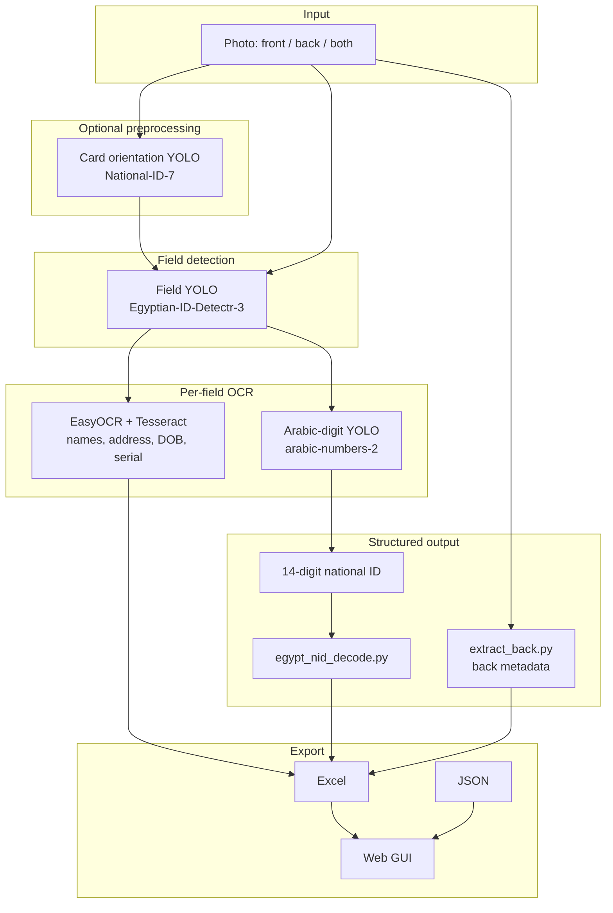

# Egyptian National ID OCR — Project Overview

A local, Windows-friendly computer-vision pipeline that reads Egyptian national ID cards from photos, extracts structured fields (name, address, national ID number, dates, serial, and back-side metadata), decodes the 14-digit national ID into birth date / governorate / gender, and exports results to Excel, JSON, or a web test UI.

**Project root:** `C:\Users\yassi\Downloads\dataset`

For day-to-day commands, flags, and troubleshooting, see [README.md](README.md).

---

## Problem

Egyptian national ID cards mix Arabic script, Arabic-Indic digits, Latin serial prefixes, and a fixed 14-digit national ID encoding. Manual transcription is slow and error-prone. This project automates:

1. **Finding** each field on a card photo (even when the card is slightly rotated or cropped poorly).
2. **Reading** Arabic text and digits with OCR tuned for ID layouts.
3. **Decoding** the national ID number into structured demographic metadata.
4. **Exporting** a single row per card (front, back, or merged) for review or downstream use.

All processing runs **locally** — no cloud OCR APIs.

---

## Features

| Capability | Details |
|------------|---------|
| **Field detection** | YOLOv8 locates 31 field types (name, address, NID strip, DOB, serial, photo, back fields, …) |
| **Arabic OCR** | EasyOCR + Tesseract (`mixed` engine by default) |
| **14-digit NID** | Dedicated Arabic-digit YOLO reads digit boxes left-to-right on the NID crop |
| **NID decode** | Birth date, governorate, gender, century, check digit from ID structure |
| **Back of card** | Job, religion, marital status, expiry, back NID via EasyOCR + regex |
| **Front + back merge** | One Excel/JSON row from two images |
| **Web GUI** | FastAPI + `index.html` for drag-and-drop testing |
| **Training** | Re-train all YOLO stages from Roboflow datasets under this repo |

---

## Architecture



### Three YOLO models

| Stage | Dataset | Weights (default) | Role |
|-------|---------|-------------------|------|
| **1 — Fields** | `egyptian_id_detectr/content/Egyptian-ID-Detectr-3/` | `runs/train_id_detectr_hyper/weights/best.pt` | Crop `firstName`, `lastName`, `address`, `nid`, `dob`, `serial`, … |
| **2 — Arabic digits** | `arabic_numbers/content/arabic-numbers-2/` | `runs/train_arabic_numbers_v2/weights/best.pt` | Classify digit 0–9 on NID strip |
| **3 — Card orientation** | `national_id/content/National-ID-7/` | `runs/train_national_id_v7/weights/best.pt` | Optional `--auto-card-crop` |

---

## National ID format

The 14-digit Egyptian national ID follows the structure documented by [Eslam2014/extract-information-from-eg-national-id](https://github.com/Eslam2014/extract-information-from-eg-national-id):

```
x - yymmdd - ss - iiig - z

Example: 3 031224 02 0185 9
         │  │      │  │    └── check digit (1–9)
         │  │      │  └─────── sequence; digit 13 → gender (odd=Male, even=Female)
         │  │      └────────── governorate code (e.g. 02 = Alexandria)
         │  └───────────────── birth date (century digit x + yy/mm/dd)
         └──────────────────── century: 2 → 1900s, 3 → 2000s, …
```

Implemented in `egypt_nid_decode.py`:

```powershell
py egypt_nid_decode.py 30312240201859
```

---

## Tech stack

| Layer | Libraries / tools |
|-------|-------------------|
| Object detection | [Ultralytics YOLOv8](https://github.com/ultralytics/ultralytics) |
| Image I/O | OpenCV (`opencv-python`) |
| Arabic OCR | EasyOCR, Tesseract (`pytesseract`, Arabic language pack) |
| Web UI | FastAPI, Uvicorn |
| Export | pandas, openpyxl |
| Training data | Roboflow datasets (CC BY 4.0) |

**Platform:** Developed and tested on **Windows** (PowerShell). GPU optional (CUDA + PyTorch); CPU fallback supported.

---

## Project structure

```
dataset/
├── PROJECT.md                  ← this overview
├── README.md                   ← operational reference (commands, flags, troubleshooting)
├── index.html                  ← web GUI frontend
│
├── extract_id_all.py           ← main entry point (front + back + export)
├── export_id_to_excel.py       ← Excel/JSON helpers + YOLO loaders
├── extract_name_address.py     ← names + address OCR
├── extract_nid_digits.py       ← NID digit pipeline only
├── extract_back.py             ← back-of-card extraction
├── egypt_nid_decode.py         ← 14-digit ID decoder
├── gui_app.py                  ← FastAPI test server
├── predict_my_id.py            ← YOLO detection preview
├── run_egyptian_id_ocr.py      ← train all model stages
│
├── egyptian_id_ocr.ipynb       ← Colab reference notebook
├── egyptian_id_ocr_local.ipynb ← local training mirror
│
├── egyptian_id_detectr/        ← field detection dataset (31 classes)
├── arabic_numbers/             ← Arabic digit dataset
├── national_id/                ← card orientation dataset
│
├── runs/                       ← trained weights, exports, GUI temp
│   ├── train_id_detectr_hyper/
│   ├── train_arabic_numbers_v2/
│   ├── train_national_id_v7/
│   └── id_export/
│
└── tests/                      ← NID validation + metrics helpers
    ├── nid_validate.py
    └── id_metrics.py
```

---

## Quick start

### Install dependencies

```powershell
cd C:\Users\yassi\Downloads\dataset

py -m pip install ultralytics opencv-python pytesseract pyyaml pandas openpyxl easyocr fastapi uvicorn python-multipart
```

Install [Tesseract for Windows](https://github.com/UB-Mannheim/tesseract/wiki) with the **Arabic** language pack.

### Extract from one image

```powershell
py extract_id_all.py "C:\path\to\id_front.jpg"
```

Output defaults to `runs\id_export\<image_stem>_full.xlsx`.

### Front + back merged

```powershell
py extract_id_all.py "front.jpg" --back-image "back.jpg" --output runs\id_export\merged.xlsx
```

### Web GUI

```powershell
py gui_app.py
```

Open **http://127.0.0.1:8000/** after the terminal shows `[warmup] Server ready`.

---

## Typical output fields

| Field | Source |
|-------|--------|
| `first_name`, `last_name`, `full_name` | OCR on YOLO name crops |
| `address` | OCR on address crop |
| `national_id` | Digit YOLO on `nid` crop (LTR merge) |
| `dob` | Printed DOB OCR, or filled from NID decode |
| `serial` | Tesseract English + Roman `II` → `11` fix |
| `decoded_birth_date`, `decoded_governorate`, `decoded_gender` | `egypt_nid_decode.py` |
| `job`, `religion`, `expiry`, `back_nid` | Back-side pipeline (`extract_back.py`) |
| `photo_path` | Cropped portrait from `photo` field |

---

## Training (optional)

Re-train from local Roboflow exports:

```powershell
py run_egyptian_id_ocr.py
```

Requires a CUDA GPU. On Windows, training uses `workers=0` to avoid dataloader multiprocessing issues. Weights are saved under `runs/<run_name>/weights/best.pt`.

---

## Testing & validation

The `tests/` package provides:

- **`nid_validate.py`** — validates extracted 14-digit IDs and cross-checks DOB against decoded birth date.
- **`id_metrics.py`** — normalization helpers for evaluation runs.

Sample inference outputs and benchmarks live under `runs/test/`.

---

## Design references

This pipeline combines ideas from two open-source Egyptian ID projects:

| Project | Contribution to this repo |
|---------|---------------------------|
| [Eslam2014/extract-information-from-eg-national-id](https://github.com/Eslam2014/extract-information-from-eg-national-id) | NID digit structure, governorate codes → `egypt_nid_decode.py` |
| [Mostafa-Emad77/Egyptian-ID-Extraction](https://github.com/Mostafa-Emad77/Egyptian-ID-Extraction) | ROI-based OCR workflow → YOLO fields + per-region OCR + GUI pattern |

Improvements over fixed-coordinate approaches: **YOLO field detection** adapts to photo angle and partial crops instead of requiring a perfectly rectified card.

---

## Privacy & security

- Processing is **entirely local** — images are not sent to external APIs.
- Real ID photos are **gitignored** under `test_data/id_cards/`; do not commit PII.
- Roboflow API keys belong in environment variables (`ROBOFLOW_API_KEY`), not in notebooks or source.
- Use exported data responsibly and in compliance with identity-document privacy laws.

---

## Datasets & license

Training images come from Roboflow Universe datasets (typically **CC BY 4.0**). See `README.roboflow.txt` in each dataset’s `content/` folder for attribution and terms.

| Dataset | Roboflow project | Classes / purpose |
|---------|------------------|-------------------|
| Egyptian-ID-Detectr-3 | [egyptian-id-detectr](https://universe.roboflow.com/omartamer0/egyptian-id-detectr/dataset/3) | 31 field boxes |
| arabic-numbers-2 | Arabic digit detection | Digits 0–9 |
| National-ID-7 | Card orientation | `front-up`, `front-left`, … |

---

## Related files

- **[README.md](README.md)** — full CLI reference, flags, troubleshooting, folder layout
- **`test_data/id_cards/README.md`** — local PII test dataset layout and edge-case tags
- **`tests/`** — pytest suite (`test_id_metrics.py`, `test_id_extraction_suite.py`, `harness.py`, `run_suite.py`)
- **`egyptian_id_ocr_local.ipynb`** — interactive local training and inference
- **`runs/id_export/`** — default location for Excel and JSON exports

---

## Automated testing

| Command | Purpose |
|---------|---------|
| `py -m pytest tests/test_id_metrics.py -q` | Fast unit tests (metrics, NID prefill) |
| `py -m pytest tests/ -m slow -q` | End-to-end + per-stage on Roboflow fixture |
| `py -m tests.run_suite --generate-json-templates` | Create hand-fillable JSON per image |
| `py -m tests.run_suite --data-dir test_data/id_cards` | Full dataset run → `runs/test/report_<ts>.md` |
| `py -m tests.run_suite --redact` | Same report with NIDs redacted (safer to share) |
| `py -m tests.synthetic.generate --count 5 --tags rotated,blurry` | Fake watermarked fixtures → `test_data/id_cards/` (gitignored) |
| `py -m tests.labeling.import_roboflow` | Front-ready Roboflow photos → `real/` with `source` tags |
| `py -m tests.labeling.prefill` | Draft OCR JSON + YOLO boxes (`review_status: needs_review`, `source` required) |
| `py -m tests.labeling.review_app` | Human review UI → verified JSON + train/valid promotion |
| `py run_egyptian_id_ocr.py --stage field_detection --name train_id_detectr_hyper_v2 --force` | Retrain field detector only (new weights path) |
| `py -m tests.labeling.compare_weights` | v1 vs v2 accuracy on `test_data/id_cards` |

Ground truth lives in gitignored `test_data/id_cards/`; committed regression uses `tests/fixtures/ground_truth/15-2-....json` on the public Roboflow test image. Reports under `runs/test/` may contain PII — do not commit them.
