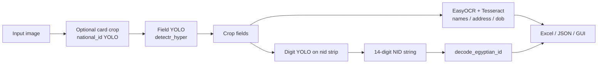

# Egyptian National ID OCR Pipeline

Local Windows-friendly pipeline to detect fields on Egyptian national ID cards, read Arabic text and digits, decode the 14-digit national ID, and export results to Excel or a web test GUI.

**Project root:** `C:\Users\yassi\Downloads\dataset`

---

## What it does

| Output | How it is obtained |
|--------|---------------------|
| **First / last / full name** | YOLO field boxes → **EasyOCR + Tesseract** (mixed engine) |
| **Address** | Same as names (Arabic OCR) |
| **National ID (14 digits)** | YOLO `nid` crop → **Arabic-digit YOLO** (`train_arabic_numbers_v2`), left-to-right merge |
| **DOB** | Printed `dob` field OCR; if missing or garbage → filled from **NID decode** |
| **Serial** | Tesseract `eng` + **II→11 fix** for Roman numeral prefixes (e.g. `II8036414`) |
| **Decoded metadata** | Birth date, governorate, gender, century from NID structure |

---

## Models (three YOLO stages)

Aligned with `egyptian_id_ocr.ipynb` / Roboflow datasets under this repo:

| Stage | Dataset folder | Default weights | Purpose |
|-------|----------------|-----------------|---------|
| **1 — Fields** | `egyptian_id_detectr/content/Egyptian-ID-Detectr-3/` | `runs/train_id_detectr_hyper/weights/best.pt` | `firstName`, `lastName`, `address`, `nid`, `dob`, `serial`, … |
| **2 — Arabic digits** | `arabic_numbers/content/arabic-numbers-2/` | `runs/train_arabic_numbers_v2/weights/best.pt` | Digit boxes 0–9 on the NID strip |
| **3 — Card orientation** | `national_id/content/National-ID-7/` | `runs/train_national_id_v7/weights/best.pt` | `front-up`, `front-left`, … (optional crop via `--auto-card-crop`) |

**Important:** `National-ID-7` **train images** are for card **orientation**, not full field OCR. For testing extraction, use a **clear front-of-card photo** or your Samsung Notes screenshot—not orientation-only train tiles unless you accept partial/`invalid_*` fallback reads.

---

## Quick start

### 1. Dependencies

```powershell
cd C:\Users\yassi\Downloads\dataset

py -m pip install ultralytics opencv-python pytesseract pyyaml pandas openpyxl
py -m pip install easyocr
py -m pip install fastapi uvicorn python-multipart
```

**Tesseract (Windows)**  
- Install: [UB Mannheim Tesseract](https://github.com/UB-Mannheim/tesseract/wiki)  
- Enable **Arabic** language data during setup  
- Optional: `set TESSERACT_CMD=C:\Program Files\Tesseract-OCR\tesseract.exe`

**GPU (optional)**  
- PyTorch with CUDA for faster YOLO  
- Scripts use `device=0` when CUDA is available, else CPU

### 2. One command — full extraction (recommended)

**Front only:**

```powershell
py extract_id_all.py "C:\path\to\your_id.jpg"
```

**Back only:**

```powershell
py extract_id_all.py "back.jpg" --back --output runs\id_export\back.xlsx
```

**Front + back merged (one Excel row):**

```powershell
py extract_id_all.py "front.jpg" --back-image "back.jpg" --output runs\id_export\merged.xlsx
```

**Auto-detect side on a single image:**

```powershell
py extract_id_all.py "id_photo.jpg" --auto-detect-side
```

Default Excel: `runs\id_export\<image_stem>_full.xlsx` (columns: name, address, NID, serial, photo_path, job, religion, expiry, back_nid, decode fields, …)

With JSON and debug crops:

```powershell
py extract_id_all.py "id.jpg" --output runs\id_export\out.xlsx --json-out runs\id_export\out.json --save-crops runs\id_export\crops
```

### 3. Web test GUI

```powershell
py gui_app.py
```

1. Wait in the terminal for: `[warmup] Server ready for /process requests.`
2. Open **http://127.0.0.1:8000/**
3. Upload an ID image → **PROCESS ID CARD**

The GUI uses `index.html` and calls `POST /process` → `extract_id_all.py`. First startup loads EasyOCR once (~1–2 minutes); later runs are faster.

---

## Main scripts

| Script | Role |
|--------|------|
| **`extract_id_all.py`** | **Primary entry point** — front + back, photo crop, merged Excel/JSON |
| **`extract_back.py`** | Back-card EasyOCR + regex (job, religion, dates, back_nid) |
| **`gui_app.py`** | FastAPI server + `index.html` test UI |
| **`export_id_to_excel.py`** | Thin wrapper around `extract_id_all` (default); `--tesseract-only` for legacy OCR |
| **`extract_name_address.py`** | Names + address only (mixed OCR) |
| **`extract_nid_digits.py`** | 14-digit NID from digit YOLO only (`--nid-field-weights` for nid crop) |
| **`predict_my_id.py`** | YOLO overlay preview on an image |
| **`run_egyptian_id_ocr.py`** | Train all four notebook stages locally (`workers=0` on Windows) |
| **`egyptian_id_ocr_local.ipynb`** | Local notebook mirror of the Colab pipeline |
| **`egyptian_id_ocr.ipynb`** | Original Colab reference (large; includes training history) |

---

## `extract_id_all.py` — useful flags

```powershell
py extract_id_all.py "image.jpg" [options]
```

| Flag | Default | Description |
|------|---------|-------------|
| `--engine` | `mixed` | `mixed` \| `easyocr` \| `tesseract` (screenshots need `mixed` or `easyocr`) |
| `--lang-mode` | `both` | Tesseract: try `ara` and `ara+eng` |
| `--conf` | `0.25` | Field detector confidence |
| `--digit-weights` | auto | Arabic-digit `.pt` (uses `train_arabic_numbers_v2` if present) |
| `--digit-reading-order` | `ltr` | Sort digit boxes left-to-right on NID strip |
| `--decode-nid` / `--no-decode-nid` | decode on | Add governorate, gender, birth date from NID |
| `--no-dob-from-nid` | off | Do not copy decoded birth date into `dob` |
| `--auto-card-crop` | off | Crop card with `train_national_id_v7` before fields |
| `--strip-address-digits` | off | Remove digit runs from address (notebook behavior) |
| `--no-fallback-invalid-fields` | off | Skip OCR on `invalid_*` boxes when no normal fields |

---

## Excel / JSON columns

Typical row from `extract_id_all`:

- `first_name`, `last_name`, `full_name`, `address`
- `dob`, `serial`
- `national_id`, `national_id_yolo_digits`, `national_id_raw_ocr` (debug)
- `decoded_birth_date`, `decoded_century`, `decoded_governorate`, `decoded_gender`
- `nid_decode_error` (empty if decode OK)
- `image_path`

---

## Pipeline flow (high level)



---

## Training (optional)

From project root, with datasets already under `egyptian_id_detectr`, `arabic_numbers`, `national_id`:

```powershell
py run_egyptian_id_ocr.py
```

Or uncomment training cells in `egyptian_id_ocr_local.ipynb`. On Windows use **`workers=0`** in YOLO `train()` to avoid dataloader errors.

Weights are written under `runs/` (e.g. `runs/train_id_detectr_hyper/weights/best.pt`).

---

## Troubleshooting

| Symptom | Likely cause | What to do |
|---------|--------------|------------|
| Empty name/address (`ntl`, gibberish) | Tesseract-only on screenshots | Use `extract_id_all` or `--engine mixed`; install EasyOCR |
| Wrong serial (`118…` vs `II…`) | `11` read as Roman `II` | Serial OCR uses A–Z0-9 allowlist by default; pass `--no-serial-charset-restrict` to disable |
| Weak / wrong Arabic names on real photos | EasyOCR-only on name crops | **Default:** `extract_id_all` and `run_suite` score EasyOCR vs Tesseract(ara) on firstName/lastName (`local_engine_select_name=True`). Pass `--no-local-engine-select-name` to disable |
| Empty `dob` but good `decoded_birth_date` | Printed DOB not read | Default: `dob` filled from decode when OCR is not date-like |
| GUI stuck on step 4 | Long OCR + old UI timers | Restart `gui_app.py`; wait for warmup; watch elapsed seconds |
| All fields empty on National-ID-7 train image | Wrong dataset for field OCR | Use a real front-ID photo; or rely on `invalid_*` fallback (partial) |
| `national_id` not 14 digits | Bad nid crop or full-card digit noise | Use `--nid-field-weights` + `--digit-reading-order ltr` via `extract_nid_digits.py` to debug |
| Tesseract not found | Not on PATH | Install Tesseract or set `TESSERACT_CMD` |
| Excel permission error | File open in Excel | Close workbook or use timestamped copy from `write_excel_safe` |

---

## Folder layout (summary)

```
dataset/
├── README.md                 ← this file
├── index.html                ← web GUI frontend
├── gui_app.py                ← FastAPI backend
├── extract_id_all.py         ← main extractor
├── export_id_to_excel.py
├── extract_name_address.py
├── extract_nid_digits.py
├── predict_my_id.py
├── run_egyptian_id_ocr.py
├── egyptian_id_ocr.ipynb
├── egyptian_id_ocr_local.ipynb
├── egyptian_id_detectr/      ← field dataset + data.yaml
├── arabic_numbers/           ← digit dataset
├── national_id/              ← card orientation dataset
└── runs/                     ← trained weights, exports, GUI temp
    ├── train_id_detectr_hyper/
    ├── train_arabic_numbers_v2/
    ├── train_national_id_v7/
    └── id_export/            ← Excel/JSON outputs
```

---

## Security notes

- Do **not** commit Roboflow API keys in notebooks; use environment variable `ROBOFLOW_API_KEY` if re-downloading datasets.
- Processing is **local**; the GUI does not send images to external APIs (only your machine + installed OCR libs).
- Remove or redact real ID images from shared repos.

---

## Example (verified screenshot)

```powershell
py extract_id_all.py "C:\Users\yassi\Downloads\Screenshot_20260517_034318_Samsung Notes.jpg"
```

Expected-style output:

- **Name:** ياسين / full patronymic chain in `last_name`
- **Address:** Arabic street text (Alexandria area)
- **NID:** `30312240201859`
- **DOB / decoded:** `2003-12-24`, Alexandria, Male
- **Serial:** `II8036414` (after Roman-II correction)

---

## Reference projects (design alignment)

This pipeline combines ideas from two open-source Egyptian ID projects:

### [Eslam2014/extract-information-from-eg-national-id](https://github.com/Eslam2014/extract-information-from-eg-national-id)

**What we use:** The **14-digit NID structure** and governorate lookup.

| Segment | Digits | Meaning |
|---------|--------|---------|
| `x` | 1 | Century code (`2` → 1900s, `3` → 2000s) |
| `yymmdd` | 2–7 | Date of birth |
| `ss` | 8–9 | Birth governorate code |
| `iiig` | 10–13 | Sequence; **gender** is digit 13 (odd=Male, even=Female) |
| `z` | 14 | Ministry check digit (1–9) |

**In this repo:** `egypt_nid_decode.py` (CLI: `py egypt_nid_decode.py 30312240201859`) and `decode_egyptian_id()` in `export_id_to_excel.py`.

### [Mostafa-Emad77/Egyptian-ID-Extraction](https://github.com/Mostafa-Emad77/Egyptian-ID-Extraction)

**What we use:** The **workflow pattern** — preprocess → extract ROIs → OCR per region → JSON/text output.

| Their step | Our equivalent |
|------------|----------------|
| Card rectification (`card-rectification`) | Optional `--auto-card-crop` (YOLO `train_national_id_v7`) |
| Fixed ROI coordinates | **YOLO field detector** (`Egyptian-ID-Detectr-3`) — adapts to photo angle |
| ArabicOCR + Tesseract on each ROI | **EasyOCR** (fast GUI) or **mixed** (accurate CLI) |
| `gui.py` | `gui_app.py` + `index.html` |

We do **not** bundle their `card-rectification` submodule; use a straight, well-lit card photo or enable auto-crop.

---

## Automated test suite

Regression tests for name, address, national ID, and DOB extraction.

```powershell
# Fast unit tests (no OCR)
py -m pytest tests/test_id_metrics.py -q

# Full regression on Roboflow test image 15-2 (slow, needs weights + EasyOCR)
py -m pytest tests/test_id_extraction_suite.py -m slow -q

# Local labeled dataset + HTML/Markdown report
py -m tests.run_suite --data-dir test_data\id_cards --report runs\test_reports\latest
py -m tests.run_suite --generate-template
```

- **Ground truth:** pair each image in `test_data/id_cards/` with a same-stem `.json` (see `test_data/id_cards/README.md`).
- **Privacy:** `test_data/id_cards/` is **gitignored** — do not commit real ID scans.
- **Committed fixture:** `tests/fixtures/ground_truth/15-2-....json` for the public Roboflow test image.

---

## License & datasets

Roboflow datasets in this project are subject to their respective licenses (see `README.roboflow.txt` under each `content/` folder, typically CC BY 4.0). Use trained models and exported data responsibly and in line with privacy laws for identity documents.
